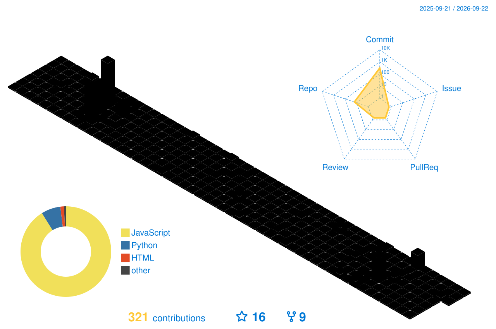
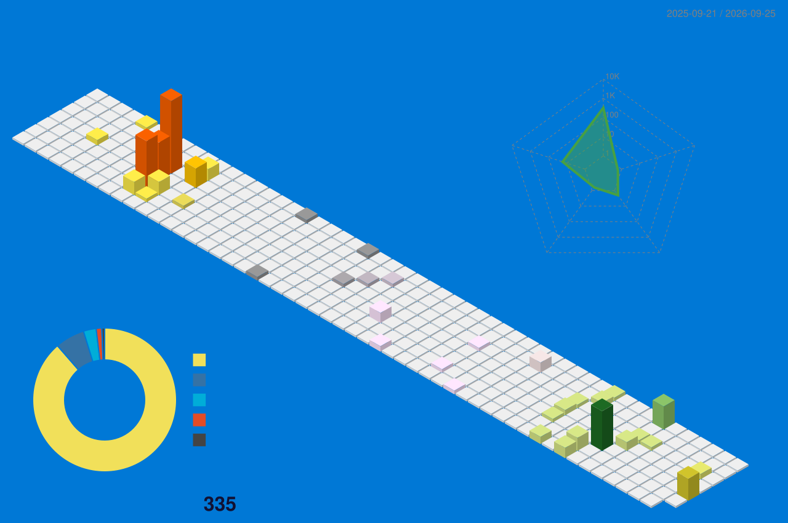

<!-- markdownlint-disable MD033 MD041 -->

<!-- ═══════════════════════════════════════════════════════════════ -->
<!--                         HEADER                                  -->
<!-- ═══════════════════════════════════════════════════════════════ -->

  

<!-- ═══════════════════════════════════════════════════════════════ -->
<!--                     TYPING ANIMATION                            -->
<!-- ═══════════════════════════════════════════════════════════════ -->

  

<!-- ═══════════════════════════════════════════════════════════════ -->
<!--                        BADGES                                   -->
<!-- ═══════════════════════════════════════════════════════════════ -->

  
  
  

 

<!-- ═══════════════════════════════════════════════════════════════ -->
<!--              SNAKE ANIMATION                                    -->
<!--  Настройка: https://github.com/Platane/snk#github-action       -->
<!-- ═══════════════════════════════════════════════════════════════ -->

  <picture>
    <source media="(prefers-color-scheme: dark)" srcset="https://raw.githubusercontent.com/war100ck/war100ck/output/github-contribution-grid-snake-dark.svg" />
    <source media="(prefers-color-scheme: light)" srcset="https://raw.githubusercontent.com/war100ck/war100ck/output/github-contribution-grid-snake.svg" />
    
  </picture>

<!-- ═══════════════════════════════════════════════════════════════ -->
<!--                     🛠️ TECH STACK                               -->
<!-- ═══════════════════════════════════════════════════════════════ -->
## 🛠️ Tech Stack

### 💻 Languages & Runtime

  

### 🌐 Web & Frameworks

  

### 🗄️ Databases & Tools

  
  
  

<!-- ═══════════════════════════════════════════════════════════════ -->
<!--                   🎯 DEVELOPMENT FOCUS                          -->
<!-- ═══════════════════════════════════════════════════════════════ -->
## 🎯 Development Focus

| 🎮 Game Tools | 🛡️ Server Dev | 🌐 Web APIs | 💻 Desktop Apps | ⚡ Automation |
|:---:|:---:|:---:|:---:|:---:|
| Private Server Launchers | Private Server Tools | RESTful Services | Electron / Tkinter | Scripts & Tools |

<!-- ═══════════════════════════════════════════════════════════════ -->
<!--                  📊 GITHUB ANALYTICS                            -->
<!-- ═══════════════════════════════════════════════════════════════ -->
## 📊 GitHub Analytics

### 📈 Stats & Streak

  
  

### 📊 Activity Graph

### 🗣️ Top Languages

<!-- ═══════════════════════════════════════════════════════════════ -->
<!--              🗓️ 3D CONTRIBUTION CALENDAR                        -->
<!--  Настройка: https://github.com/yoshi389111/github-profile-3d-contrib -->
<!-- ═══════════════════════════════════════════════════════════════ -->
## 🗓️ 3D Contribution Calendar

### 🌙 Dark Mode

### ☀️ Light Mode

<!-- ═══════════════════════════════════════════════════════════════ -->
<!--              📈 GITHUB METRICS (Расширенная аналитика)          -->
<!--  Настройка: https://github.com/lowlighter/metrics               -->
<!-- ═══════════════════════════════════════════════════════════════ -->
## 📈 GitHub Metrics

### 🔥 Общая активность

### 💻 Языки программирования (в динамике)

### ⏰ Часовые пояса активности

### 🏗️ Структура репозиториев

<!-- ═══════════════════════════════════════════════════════════════ -->
<!--                 🏆 GITHUB ACHIEVEMENTS                          -->
<!-- ═══════════════════════════════════════════════════════════════ -->
## 🏆 GitHub Achievements

  

<!-- ═══════════════════════════════════════════════════════════════ -->
<!--                 🌟 FEATURED PROJECTS                            -->
<!--  Заменено на shields.io — работает стабильно, не падает       -->
<!-- ═══════════════════════════════════════════════════════════════ -->
## 🌟 Featured Projects

### 🎮 Private Server Tools
<table>
  <tr>
    <td width="50%" align="center">
      <a href="https://github.com/war100ck/blade-soul-game-launcher">
         
        <b>Лаунчер для приватного сервера B&S</b> 
        
        
      </a>
    </td>
    <td width="50%" align="center">
      <a href="https://github.com/war100ck/BNS-Server-Manager">
         
        <b>Управление сервером Blade & Soul</b> 
        
        
      </a>
    </td>
  </tr>
</table>

### 🌐 API Servers
<table>
  <tr>
    <td width="50%" align="center">
      <a href="https://github.com/war100ck/BnS-Api-Server">
         
        <b>REST API для игрового сервера</b> 
        
        
      </a>
    </td>
    <td width="50%" align="center">
      <a href="https://github.com/war100ck/Server-Api-BnS-2017">
         
        <b>API сервер для B&S 2017 клиента</b> 
        
        
      </a>
    </td>
  </tr>
</table>

### 🔧 Utility Applications
<table>
  <tr>
    <td width="50%" align="center">
      <a href="https://github.com/war100ck/Steam-Account-Manager">
         
        <b>Менеджер аккаунтов Steam</b> 
        
        
      </a>
    </td>
    <td width="50%" align="center">
      <a href="https://github.com/war100ck/bns-client-packer">
         
        <b>Пакер клиента Blade & Soul</b> 
        
        
      </a>
    </td>
  </tr>
</table>

<!-- ═══════════════════════════════════════════════════════════════ -->
<!--                 🏆 GITHUB ACHIEVEMENTS                          -->
<!-- ═══════════════════════════════════════════════════════════════ -->
## 🏆 GitHub Achievements

  

<!-- ═══════════════════════════════════════════════════════════════ -->
<!--                 🌟 FEATURED PROJECTS                            -->
<!-- ═══════════════════════════════════════════════════════════════ -->
## 🌟 Featured Projects

### 🎮 Private Server Tools

  
  

### 🌐 API Servers

  
  

### 🔧 Utility Applications

  
  

<!-- ═══════════════════════════════════════════════════════════════ -->
<!--                    💡 ABOUT ME                                  -->
<!-- ═══════════════════════════════════════════════════════════════ -->
## 💡 About Me

> *"Automation is the key to efficiency."*

🎯 **Automation & Efficiency** — моя основная философия разработки  
🛠️ Создаю инструменты для упрощения сложных задач  
🎮 Специализируюсь на разработке приватных серверов в образовательных целях  
🌐 Строю веб API и десктопные приложения  
⚡ Увлечён чистым кодом, надёжностью и производительностью  

 

**⚠️ Все игровые проекты предназначены исключительно для образовательного использования на приватных серверах**

<!-- ═══════════════════════════════════════════════════════════════ -->
<!--                 📫 CONNECT WITH ME                              -->
<!-- ═══════════════════════════════════════════════════════════════ -->
## 📫 Connect With Me

 

<!-- ═══════════════════════════════════════════════════════════════ -->
<!--                        FOOTER                                   -->
<!-- ═══════════════════════════════════════════════════════════════ -->

  

